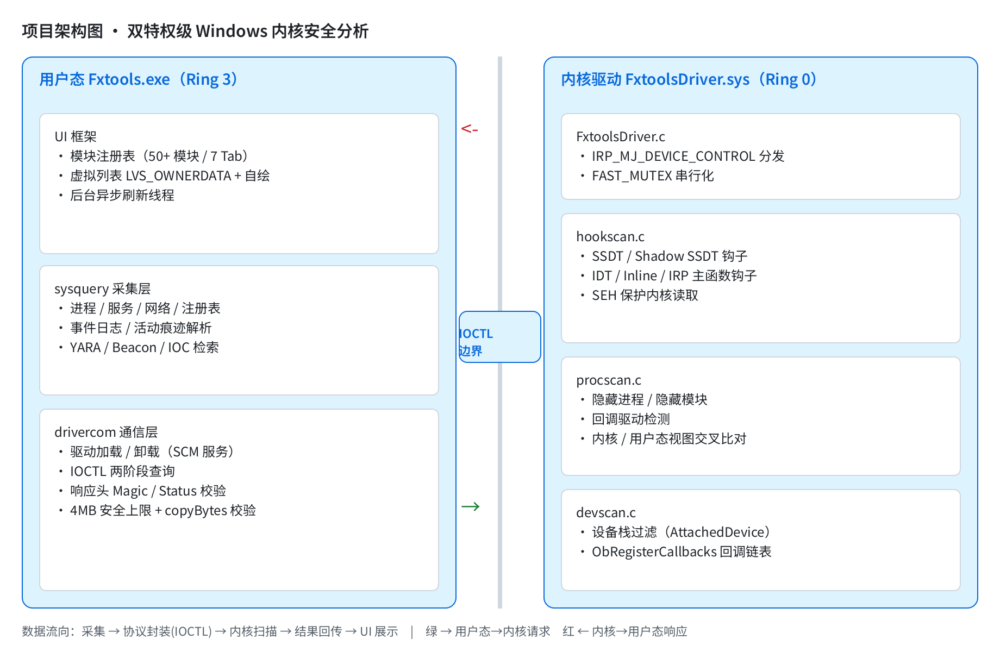
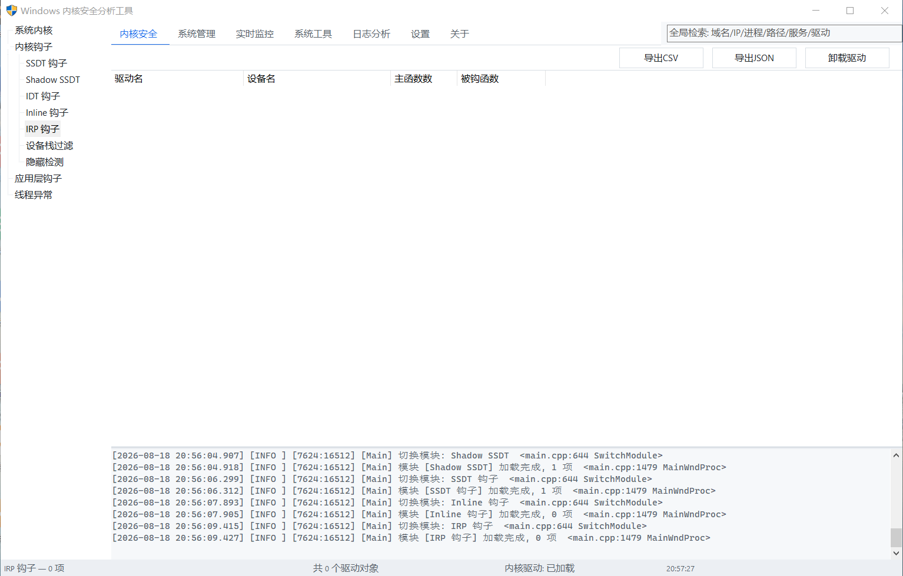
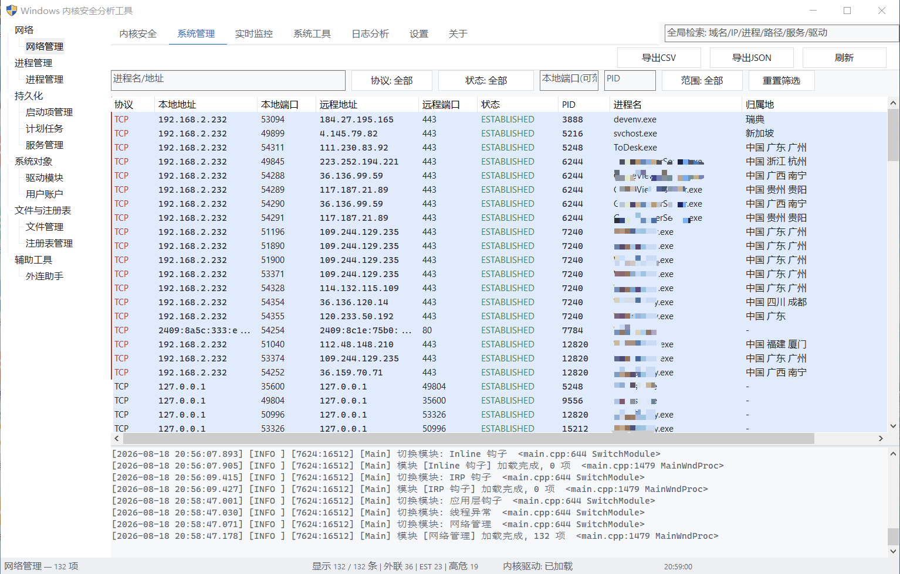
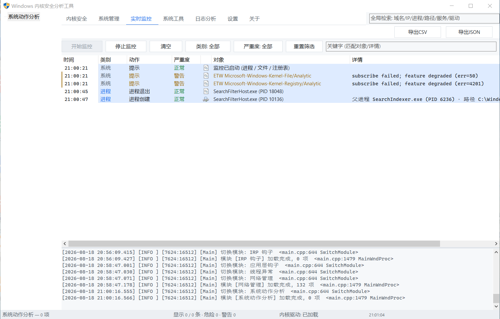
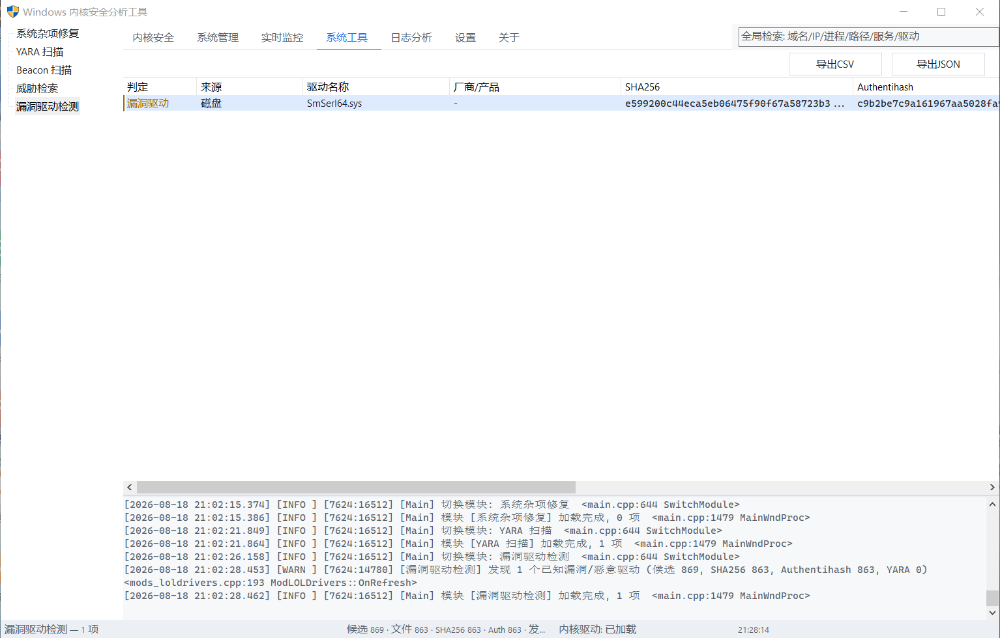
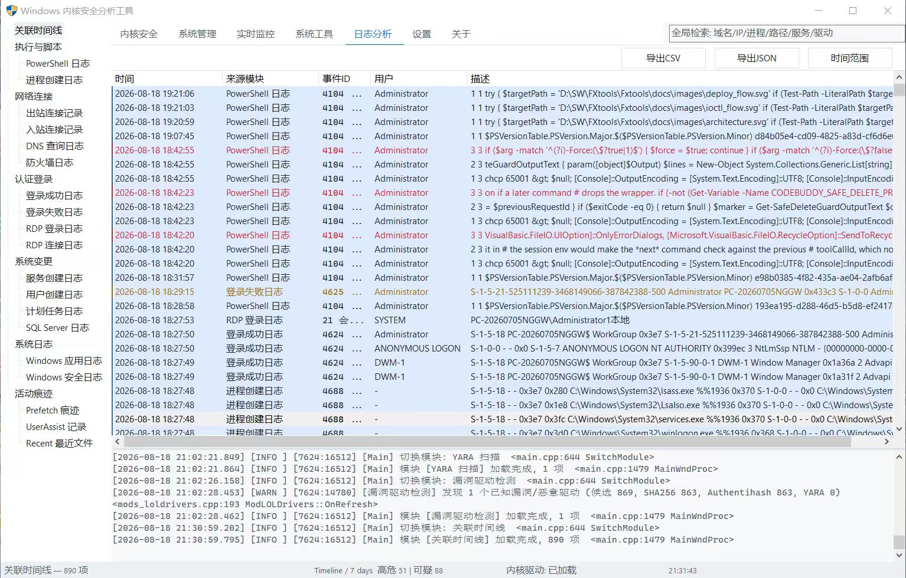
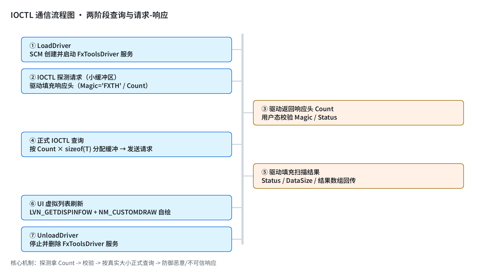

# FxTools — Windows 内核安全分析工具

> **产品定位**：Windows 系统底层反内核工具 / 手工杀毒 / 反 Rootkit / 安全应急响应辅助工具
> **目标平台**：Windows 7 / 8 / 8.1 / 10 / 11，Windows Server 2008 / 2012 / 2016 / 2019 / 2022（x64）
> **目标用户**：安全研究员、系统管理员、高级运维、逆向工程师

FxTools 是一款**双特权级**安全分析软件：用户态 `Fxtools.exe`（Win32 原生界面）负责交互与数据展示，内核驱动 `FxtoolsDriver.sys`（WDM）负责内核态扫描，两者通过 `common/common.h` 定义的 IOCTL 协议通信。它能够扫描 SSDT/IDT/Inline/IRP 钩子、检测隐藏进程与隐藏模块、分析系统日志与活动痕迹，并集成 YARA 规则扫描、Beacon 行为探测与漏洞驱动（LOLDrivers）检测，覆盖应急响应的"查、验、取、析"全流程。



---

## 目录

- [项目简介](#项目简介)
- [主要功能](#主要功能)
- [技术栈](#技术栈)
- [架构与核心流程](#架构与核心流程)
- [安装与使用说明](#安装与使用说明)
- [目录结构说明](#目录结构说明)
- [已知限制与兼容性](#已知限制与兼容性)
- [相关文档](#相关文档)

---

## 项目简介

### 核心能力

- **内核钩子扫描**：SSDT / Shadow SSDT / IDT / Inline / IRP 主函数五大类钩子扫描，精确定位被替换的内核函数及宿主模块（需加载驱动）
- **隐藏对象检测**：内核 PID / 模块视图与用户态视图交叉比对，发现隐藏进程与隐藏模块；设备栈过滤层检测、真实对象回调（ObRegisterCallbacks）链表枚举
- **应用层钩子检测**：进程模块入口点与磁盘文件字节比对，识别用户态 inline hook；线程异常（StartAddress 篡改 / APC 注入）检测
- **系统管理**：进程 / 服务 / 驱动 / 启动项 / 计划任务 / 用户账户 / 网络 / 文件 / 注册表全量管理与危险操作处置
- **日志分析**：基于 Windows 事件日志（安全 / 应用 / Sysmon / PowerShell 等）的登录审计、网络连接、服务创建、RDP 暴破等场景化分析，并支持 Prefetch / UserAssist / Recent 活动痕迹取证
- **威胁检测**：内置 YARA 规则库扫描、Beacon（C2 心跳）行为识别、LOLDrivers 已知漏洞驱动数据库比对、全局 IOC 检索框
- **实时监控**：系统动作分析（进程创建 / 退出等关键事件实时流）
- **修复与取证**：SFC / DISM / DNS / Winsock / Hosts / 更新重置等杂项修复；模块数据一键导出 CSV / JSON

### 项目特点

- 单二进制 x64 构建，兼容 Windows 7 ~ 11 全系（驱动内存分配按系统版本自动回退到兼容 API）
- 内核扫描全程只读、SEH 保护、PatchGuard 友好；用户态界面为纯原生 Win32 自绘控件，无重量级 UI 框架
- 驱动与用户态共享一份协议头（`common/common.h`），改动自动双端同步
- 所有危险操作（结束进程 / 递归删除注册表 / 删除服务）均有二次确认

---

## 主要功能

界面按 **7 个 Tab** 组织功能模块，共 **50+ 个模块**。侧边栏按场景分组，模块间支持一键跳转与 IOC 全局检索。

### Tab 1 · 内核安全（需驱动）

| 模块 | 说明 |
|------|------|
| 系统内核 | 操作系统 / CPU / 内存 / 运行时间等底层信息及内核基址、SSDT 表地址等 |
| SSDT 钩子 | 扫描系统服务描述表，标记被替换的 `NtXxx` 服务函数及其宿主模块 |
| Shadow SSDT | 扫描 win32kfull/win32k 的 `W32pServiceTable`（影子 SSDT），检测图形子系统钩子 |
| IDT 钩子 | 扫描中断描述符表，检测非 ntoskrnl 的中断处理函数 |
| Inline 钩子 | 扫描所有内核模块导出函数入口的 `jmp` / `push-ret` / `FF25` 修改，解析跳转目标 |
| IRP 钩子 | 枚举驱动对象，检测被替换的 IRP 主函数（`MajorFunction`） |
| 设备栈过滤 | 对键盘 / 鼠标 / 存储 / 文件系统等目标驱动遍历 `AttachedDevice` 链，检测附加过滤层 |
| 隐藏检测 | 内核 PID / 模块视图与用户态视图对照，发现隐藏进程与隐藏模块 |
| 应用层钩子 | 进程模块入口点与磁盘文件比对，检测用户态 inline hook |
| 线程异常 | 检测线程 StartAddress 篡改与可疑 APC 例程注入 |



### Tab 2 · 系统管理

| 模块 | 说明 |
|------|------|
| 进程管理 | 进程列表 / 内存 / 签名校验，结束进程 / 结束进程树，查看进程模块 |
| 网络管理 | TCP / UDP 连接与监听端口，IP 归属地与地理定位（内嵌 IP 库），关联进程并处置 |
| 外连助手 | 网络外连辅助分析（IP 类型识别、威胁线索聚合） |
| 启动项管理 | Run 键 / 启动文件夹 / 服务驱动 / IFEO，禁用与移除 |
| 计划任务 | 计划任务枚举与管理（持久化驻留排查） |
| 服务管理 | 服务 / 驱动列表，启动 / 停止 / 改启动类型 / 删除 |
| 驱动模块 | 内核驱动列表，基址 / 大小 / 签名 / 公司 / 版本 |
| 用户账户 | 本地用户与组枚举、账户状态审计 |
| 文件管理 | 目录浏览 / 删除 / 属性 / 数字签名，快速定位可疑文件 |
| 注册表管理 | 注册表树浏览，递归删除可疑键值 |



### Tab 3 · 实时监控

| 模块 | 说明 |
|------|------|
| 系统动作分析 | 实时监控进程创建 / 退出等关键事件，可结合文件 / 注册表 ETW 分析通道 |



### Tab 4 · 系统工具

| 模块 | 说明 |
|------|------|
| 系统杂项修复 | SFC / DISM / DNS 缓存 / Winsock / TCP-IP 栈 / Hosts / Windows 更新重置 / 清理临时文件 |
| YARA 扫描 | 内置 600+ 条 YARA 规则库，对文件 / 目录 / 进程内存执行规则匹配（支持进度与取消） |
| Beacon 扫描 | C2 心跳 / 外联行为特征识别，定位可疑长连接 |
| 威胁检索 | 多维度 IOC 检索与关联（IP / 哈希 / 文件名 / 进程路径） |
| 漏洞驱动检测 | 基于 LOLDrivers（magicsword-io）数据库比对已知恶意 / 易受攻击驱动的哈希与特征 |



### Tab 5 · 日志分析

按安全场景分组，数据源为 Windows 事件日志（安全 / 应用 / Sysmon / PowerShell 等）与活动痕迹文件：

| 分组 | 模块 |
|------|------|
| 时间线 | 关联时间线（跨日志源统一时间轴） |
| 执行与脚本 | PowerShell 日志、进程创建日志 |
| 网络连接 | 出站连接记录、入站连接记录、DNS 查询日志、防火墙日志 |
| 认证登录 | 登录成功日志、登录失败日志（含 4625 状态码解析）、RDP 登录日志、RDP 连接日志 |
| 系统变更 | 服务创建日志、用户创建日志、计划任务日志、SQL Server 日志 |
| 系统日志 | Windows 应用日志、Windows 安全日志 |
| 活动痕迹 | Prefetch 痕迹、UserAssist 记录、Recent 最近文件 |



### Tab 6 · 设置

常规设置、日志设置、路径设置、YARA 设置、威胁检索设置、Beacon 设置、日志模块设置。

### Tab 7 · 关于

软件版本、作者与项目信息、许可声明、使用条款等章节。

---

## 技术栈

### 用户态 `Fxtools.exe`

| 项目 | 说明 |
|------|------|
| 语言 / 标准 | C++17，`/utf-8`，`/W3`，`_WIN32_WINNT=0x0600`（兼容 Vista 内核族） |
| UI | 纯原生 Win32 自绘控件（ListView 虚拟列表 `LVS_OWNERDATA` + `NM_CUSTOMDRAW`），无 MFC / WPF |
| 构建 | Visual Studio 2022 (v143) + Windows SDK 10.0.26100，`cl / rc / link` 直接编译 |
| 数据采集 | 纯 Win32 API（Toolhelp / SCM / 事件日志 wevtapi / ETW 分析通道 / 痕迹文件解析） |
| 第三方库 | libyara 4.5.5（精简静态库，零外部依赖）；纯真 IP 库 `qqwry.ipdb`（IPIP 格式，O(32) Trie 查询）；LOLDrivers 哈希快照 |

### 内核驱动 `FxtoolsDriver.sys`

| 项目 | 说明 |
|------|------|
| 模型 | WDM（传统内核驱动），C 语言 |
| 构建 | Windows Driver Kit (WDK) 10.0.26100，仅需 km 头文件 / 库（不依赖 WDK 的 VS 扩展） |
| 关键手段 | 特征码定位 ntoskrnl 与系统表；SEH 保护的安全内存读取（`FxSafeReadPtr` / `FxSafeReadBuf`）；未文档化 API 手工声明并注释对应导入符号 |
| 兼容策略 | `ExAllocatePool2` / `MmCopyMemory` 运行时经 `MmGetSystemRoutineAddress` 动态解析，旧系统自动回退 |

### 共享协议 `common/common.h`

驱动与用户态唯一共享头，定义设备名（`\Device\FxTools`）、服务名（`FxToolsDriver`）、**13 个 IOCTL**（`0x800` ~ `0x80C`，全部 `METHOD_BUFFERED`）以及全部扫描结果结构体。每次响应统一携带 `FXTOOLS_RESPONSE_HEADER`（Magic `'FXTH'` / Count / Status / DataSize），用户态据此校验数据有效性。两端共用 `FXTOOLS_MAX_*` 记录数上限，防止缓冲区溢出。

---

## 架构与核心流程

### 整体架构

```
┌──────────────────────────── 用户态 (Ring 3) ────────────────────────────┐
│  Fxtools.exe                                                             │
│  ┌──────────────┐   ┌──────────────────────┐   ┌──────────────────────┐  │
│  │ UI 框架       │   │  sysquery 采集层      │   │  drivercom 通信层    │  │
│  │ 模块注册表     │   │ 进程/服务/网络/注册表 │   │ 驱动加载/卸载(SCM)    │  │
│  │ 虚拟列表/自绘 │   │ 日志/痕迹/YARA/Beacon │   │ IOCTL 两阶段查询      │  │
│  │ 后台刷新线程   │   │                      │   │ 响应头校验            │  │
│  └──────────────┘   └──────────────────────┘   └──────────┬───────────┘  │
└────────────────────────────────────────────────────────────┼─────────────┘
                                                    IOCTL (common.h 协议)
┌────────────────────────────────────────────────────────────┼─────────────┐
│  FxtoolsDriver.sys (Ring 0)                                ▼             │
│  ┌─────────────────────────────────────────────────────────────────────┐  │
│  │ FxtoolsDriver.c  IRP_MJ_DEVICE_CONTROL 分发（FAST_MUTEX 串行化）       │  │
│  │ ┌──────────────┐ ┌──────────────┐ ┌──────────────────────────────┐   │  │
│  │ │ hookscan.c   │ │ procscan.c   │ │ devscan.c                    │   │  │
│  │ │ SSDT/IDT/    │ │ 隐藏进程/    │ │ Shadow SSDT / 设备栈过滤 /    │   │  │
│  │ │ Inline/IRP   │ │ 隐藏模块/    │ │ ObRegisterCallbacks 回调链表  │   │  │
│  │ │ 钩子扫描     │ │ 回调检测     │ │                              │   │  │
│  │ └──────────────┘ └──────────────┘ └──────────────────────────────┘   │  │
│  └─────────────────────────────────────────────────────────────────────┘  │
└──────────────────────────────────────────────────────────────────────────┘
```

### 核心流程

1. **驱动加载**：用户态通过 SCM 服务方式创建并启动 `FxToolsDriver` 服务，从程序目录加载 `FxtoolsDriver.sys`；失败时输出精确诊断（测试签名 / Secure Boot / HVCI / 文件签名）。
2. **IOCTL 两阶段查询**（`drivercom`）：先用小缓冲区探测，从响应头读取 `Count`；校验 Magic / Status 后按 `Count × sizeof(T)` 分配缓冲正式读取，并带 4MB 安全上限与 `copyBytes` 二次校验，防御驱动返回不可信 count。
3. **驱动扫描路径**：所有扫描 IOCTL 经 `FAST_MUTEX` 串行化；对任意内核地址的读取均经 SEH 保护；未定位到目标表/符号时返回 `STATUS_NOT_FOUND` / `STATUS_NOT_IMPLEMENTED` 降级状态码，用户态据此显示"加载失败/空态"提示而非空数据。
4. **用户态模块框架**：`RegisterModules()` 注册 50+ 模块并按 Tab / 分组组织；模块采用**懒加载 + 内存缓存 + 模块间并行**，后台线程执行 `IModule::OnRefresh()` 采集，完成后 `PostMessage(WM_APP+3)` 通知 UI；表格数据读写经 `std::mutex` 隔离（后台写、UI 读）。
5. **虚拟列表展示**：ListView 使用 `LVS_OWNERDATA`（`LVN_GETDISPINFOW` 取文本）+ `NM_CUSTOMDRAW` 自绘暗/浅色主题、危险行左侧 2px 指示条；控件通知内严禁向自身同步 `SendMessage`，刷新走 `PostMessage(WM_APP+7)` 延迟处理。
6. **导出取证**：`Ctrl+S` / `Ctrl+J` 将当前模块数据导出为 CSV / JSON 留证。



---

## 目录结构说明

```
FxTools
├── common/                        # 驱动与用户态共享协议（唯一共享头）
│   └── common.h                   #   IOCTL 定义 + 响应头 + 全部结果结构体
├── Fxtools/                       # 用户态程序（Win32 C++17）
│   ├── main.cpp                   #   主框架：窗口 / Tab / 侧边栏树 / 模块注册表 / 异步加载
│   ├── theme.cpp / theme.h        #   GitHub Light/Dark 双主题（运行时按系统深色模式切换）
│   ├── uiutil.cpp / uiutil.h      #   IModule 接口、TableModule 基类、虚拟列表自绘控件
│   ├── mod_common.h               #   表格模块基类（互斥保护的数据行 + 排序 + 状态色）
│   ├── mods_a.cpp ~ mods_g.cpp    #   内核安全 / 系统管理 / 监控 / 工具等表格型模块
│   ├── mods_about.cpp / .h        #   关于页章节内容
│   ├── mods_settings.cpp / .h     #   设置页（常规 / 日志 / 路径 / YARA / 威胁检索 / Beacon / 日志模块）
│   ├── mods_beacon.cpp            #   Beacon 扫描模块
│   ├── mods_scan.cpp              #   威胁检索模块
│   ├── mods_loldrivers.cpp        #   漏洞驱动检测模块
│   ├── sysquery.h                 #   系统数据采集聚合头
│   ├── sysquery_*.cpp / .h        #   分域采集：进程 / 服务 / 网络 / 启动项 / 注册表 / 文件 /
│   │                              #   事件日志 / 活动痕迹 / 监控 / Beacon / 关联分析 / 扫描
│   ├── drivercom.cpp / .h         #   驱动加载（SCM）+ IOCTL 两阶段查询 + 失败诊断
│   ├── yaraengine.cpp / .h        #   libyara 封装（规则编译、并发扫描、进度与取消）
│   ├── ipgeo.cpp / .h             #   纯真 IP 库查询（IP 类型识别 + 地理位置）
│   ├── logger.cpp / .h            #   日志落盘（fxtools_dbg.log / 模块日志）
│   ├── settings.cpp / .h          #   应用配置读写
│   ├── loldrivers_*.inc/.tsv      #   漏洞驱动哈希快照与运行时更新库
│   ├── app.rc / app.manifest      #   资源 + 管理员权限 / DPI 感知清单
│   └── Fxtools.vcxproj            #   VS 工程文件
├── FxtoolsDriver/                 # 内核驱动（WDM，C）
│   ├── FxtoolsDriver.c            #   DriverEntry / 设备与符号链接 / IOCTL 分发（FAST_MUTEX 串行化）
│   ├── hookscan.c                 #   SSDT / IDT / Inline / IRP 钩子扫描 + 模块枚举工具
│   ├── procscan.c                 #   隐藏进程 / 隐藏模块 / 回调驱动检测
│   ├── devscan.c                  #   Shadow SSDT / 设备栈过滤 / ObRegisterCallbacks 回调链表
│   └── FxtoolsDriver.vcxproj      #   VS 工程文件
├── yara/
│   └── rules/                     # YARA 规则库（600+ 条规则，含 LOLDrivers 规则）
├── Fxtools.sln                    # 解决方案
├── DESIGN.md                      # UI/UX 设计规范
├── PLATFORM_COMPATIBILITY.md      # 平台兼容性与降级规则
└── CODEBUDDY.md                   # AI 协作项目导引
```

---

## 已知限制与兼容性

### 已知限制

- 内核功能（钩子扫描 / 隐藏检测等）需加载驱动；驱动未签名时需开启测试签名模式（`bcdedit /set testsigning on` 并重启）
- SSDT / Shadow SSDT 定位基于特征码，极新 Insider 版本可能需要适配
- 内核回调检测部分为"模块导入 API"级别，非回调链表遍历；对象回调模块为真实链表枚举
- 应用层钩子检测基于入口点字节比对，对加壳程序可能误报
- 日志分析依赖系统事件日志可用性：Sysmon 未安装时网络连接类日志回落到 Security 5156/5157；ETW 分析通道缺失 / 被禁用时监控模块降级并在日志中提示

### 平台兼容性要点

- 扫描类 IOCTL 返回 `STATUS_NOT_FOUND` / `STATUS_NOT_IMPLEMENTED` / `STATUS_ACCESS_DENIED` 时，UI 必须显示降级提示而非空数据
- PatchGuard 存在时，干净现代系统上"无钩子"是预期结果；HVCI / 内存完整性可能阻止驱动加载，用户态模块应仍可用
- PPL / 受保护进程的用户态内存扫描需报告跳过 / 拒绝计数
- 递归文件 / YARA / Recent 扫描跳过重解析点（`FILE_ATTRIBUTE_REPARSE_POINT`）目录，长路径归一化为 `\\?\` 前缀

---

## 
